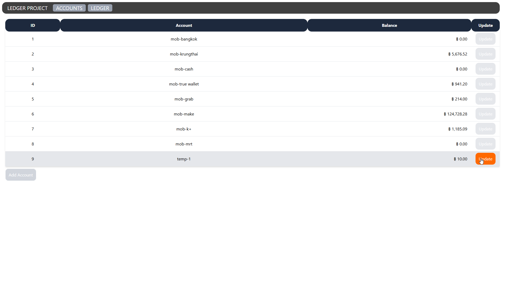
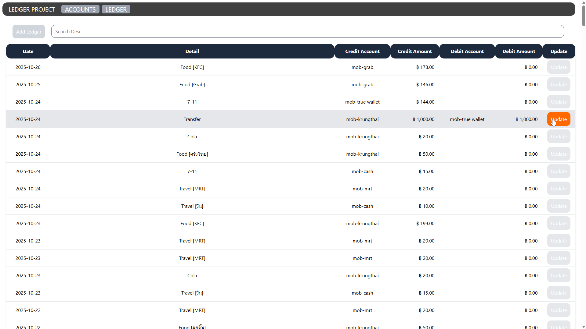
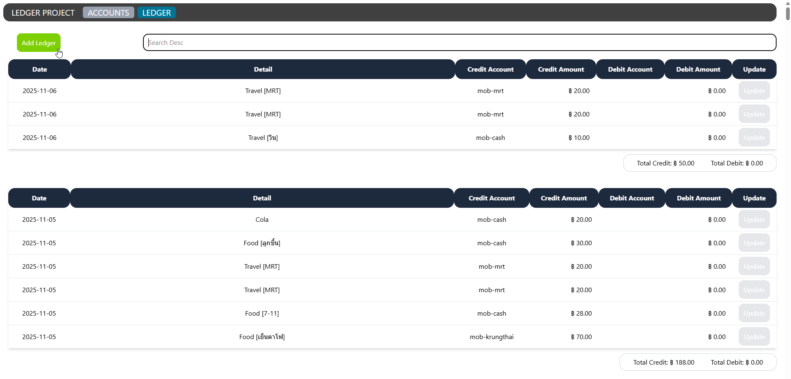
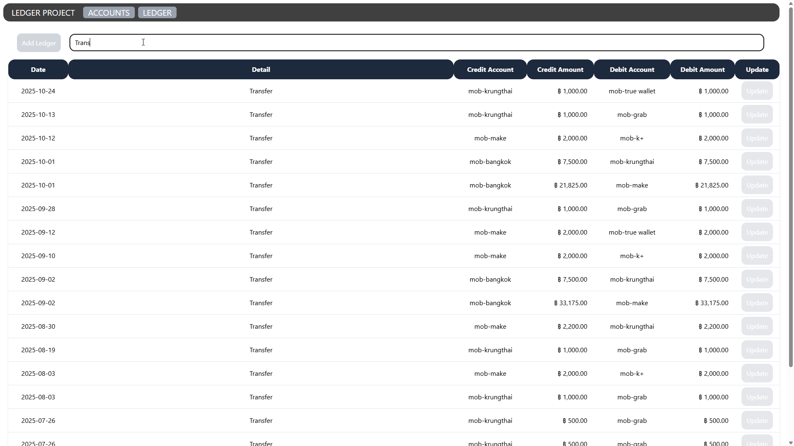
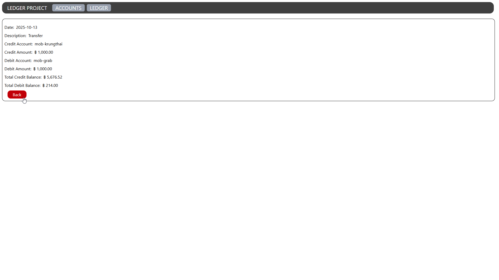
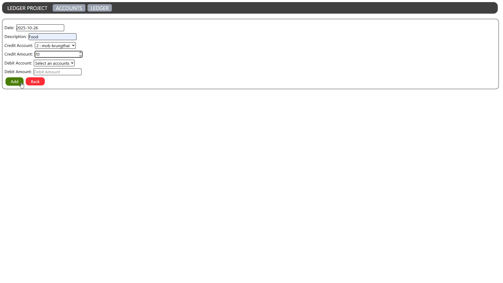

# Frontend for Ledger App
Stack: React + Vite + Bun

## Progression
- [ ] Account Delete
- [ ] Account Update
- [ ] Account Add
- [x] Account Detail
- [x] Account Listing
- [x] Ledger Delete
- [x] Ledger Update
- [x] Ledger Add
- [x] Ledger Detail
- [x] Ledger Listing

## Required
```
"http://${API_URL}/api/ledger-desc" -- as GET Method for listing ledger
"http://${API_URL}/api/ledger/:theId" -- as GET Method for detail ledger
"http://${API_URL}/api/ledger" -- as POST Method for create ledger
"http://${API_URL}/api/accounts" -- as GET Method for Listing Account
```
Reference backend by: 

## Screenshot
Account Listing


Ledger Listing



Ledger Search


Ledger Detail


Ledger Add

